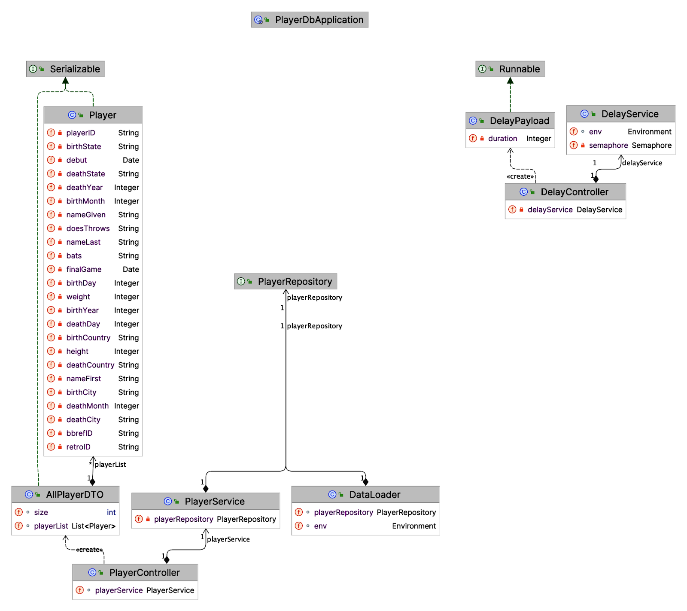

# playerDB

# Getting Started

Make sure that docker-compose is installed and running on your machine: https://www.docker.com/products/docker-desktop/

sh
# clone the repo
git clone https://github.com/nishantrastogi/playerDB.git

# change directory
cd playerDB

# initialize docker containers
docker-compose -f docker-compose.yml up -d --build

# wait for the containers to initialize - takes upto 1 minute

# open the browser and go to http://localhost:8080/api/players
# Mac
open http://localhost:8080/api/players
# Windows
start http://localhost:8080/api/players
# Linux
xdg-open http://localhost:8080/api/players
# or
gnome-open http://localhost:8080/api/players

# API Documentation

## Get all players
GET /api/players/
## Get all players - paginated
GET /api/players/paginate

## Get player by id
GET /api/players/{playerId}

## Add new player
POST /api/players/

## Delete player
DELETE /api/players/{playerId}

## Rate limiting
POST /api/sleep/{duration-seconds}

# Class Diagram

